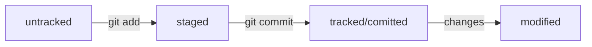

# Start Git learning

## Hash 

- use *"cd .git/"*
- cat *HEAD*
- cat *refs/heads/aster* ("last hash")

## **Base command**

1. git **init**
2. git **add** (-all)
3. git **commit** (-m "comment")
4. git **log** (--oneline)
5. git **push** (-u)
6. git **clone** (URL - HTTPS - SSH - GitHub Cli)

## ~~SSH~~

- ls -la ./ssh 
- ssh-keygen -t ed25519 -C "email"
- cat ~/.ssh/id_ed25519.pub
- setting GitHub
- ssh -T git@github.com

## Remote settings 

- [x] git remote add origin git@github.com:%name%:URL-project.git
- [x] git remote -v 
- [x] git push -u origin (master/main)

## Git status

- [ ] git **status**

  * untracked --> **Untracked files**
  * staged    --> **Changes to be committed** (git add - "staging area / indexed / cached")
  * tracked   --> after git add or git commit
  * modified  --> **Changes not stages for commit** (new version file)
  - [x] git status (--ignored) --> **Ignored files**

## Recovery 

1. If file on staged or modified --> git restore --staged **file**
2. If file was modifed --> git restore **file**
3. After git commit --> git commit reset --hard **HASH**

## Use mermaid



## Git commit 

- (--amend) --> rework last commit (HEAD)
- (-m) --> message for commit
- (--no-edit) --> save last message

#### Example 
1. git add file.pdf
2. git commit -m "add docs"
3. git add README.md
4. git commit --amend --no-edit

## Git diff

- git diff --staged (if add or commit)
- git diff (if file modifited)
- git diff *HASH* *HEAD-HASH* or *HEAD* (after commit)
- git diff *HASHBRANCH* *HASHBRANCH*

- git diff **%NAMEBRANCH%** **%NAMEBRANCH%**
- symbol **~** ---> *git diff main~3 main* --> main~3 "the third commit from the last one (HEAD)" --> main === main~0
- **main~ === main~1**

## Git branch

- git **branch** --> show all branches
- git branch %NAMEBRANCH% --> create new branch
  - example - (*features/add-branch-info*)
  - symbols **/ . _ -**
- git branch **-D** %NAMEBRANCH% --> delete force branch
- git branch **-d** %NAMEBRANCH% --> delete soft branch
- git **checkout** %NAMEBRANCH% --> switch branch
- git checkout **-b** %NAMEBRANCH% --> branch + checkout

## Git merge

- git merge **%NAMEBRANCH** -- **you can't be in this branch**

## .gitignore 

| Syntax | Description |
| ----------- | ----------- |
| **#commets** | commentary |
| **.file** | random file |
| *.jpeg | all file with expension |
| **docs/*/tmp** | all files in the child folder |
| **file?.txt** | ignore fileA.txt, file2.txt, but not file33.txt |
| **file[0 - 2].txt** | ignore file0.txt, file1.txt, file2.txt |
| **/file.txt** | ignore at the root folder |
| **setting.pdf** | ignore everywhere |
| **test/** | ignore folder |
| **keys.exe** | ignore everywhere |
| docs/**/tmp | nested ignoring |
| **!randomfile.png** | ignore everywhere |

## Code view

```
{
  "firstName": "Dmitry",
  "lastName": "Sakhno",
  "age": 26
}
```

## Table view

| Syntax | Description |
| ----------- | ----------- |
| Header | Title |
| Paragraph | Text |

## Term

Markdown
: ~~Markdown~~ is a lightweight markup language that you can use to add formatting elements to plaintext text documents.

---
---