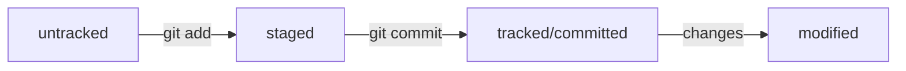

# Start Git learning

## Hash

- use *"cd .git/"*
- cat *HEAD*
- cat *refs/heads/aster*  --> last hash

## **Base command**

```sh
git [command]
              init
              add (--all, --interactive, --patch)
              commit (-m "comment")
              log (--oneline, -p)   ---> detailed information about commits
              shortlog              ---> all commits author
              push (-u)
              pull
              clone (URL - HTTPS - SSH - GitHub Cli)
              blame <FILE>          ---> annotation FILE
```

## **Deletion, modification, manipulation**

```sh
git [command]
              gc     ---> garbage collector, parent command
              reflog ---> all commit in branch
              fsck   ---> checking the repository for errors
```

## SSH

- ls -la ./ssh
- ssh-keygen -t ed25519 -C "email"
- cat ~/.ssh/id_ed25519.pub
- setting GitHub
- ssh -T <git@github.com>

- git config --global user.name 'NAME'
- git config --global user.email 'EMAIL'

## Remote settings

```sh
1 ---> git remote add origin git@github.com:%name%:URL-project.git
2 ---> git remote -v
3 ---> git push -u origin (master/main)
4 ---> git push -u origin <NAMEBRANCH>
```

## Git status

```sh
git status
  
  Untracked      --> Untracked files
  Staged         --> Changes to be committed (git add - "staging area / indexed / cached")
  Tracked        --> After git add or git commit
  Modified       --> Changes not stages for commit(new version file)
  Unmerged paths --> Conflict

Ignored files
git status (--ignored)
```

## Recovery

```sh
#If file on staged or modified 
git restore --staged <FILE>

#If file was modified 
git restore <FILE>

#After git commit
git reset --hard <HASH>

#Index file
git rm --cached <FILE>
```

## Use mermaid



## Git commit

```sh
git commit
  (--amend)     --> rework last commit (HEAD) (add or mistake)
  (-m)          --> message for commit
  (--no-edit)   --> save last message
```

### Example

1. git add file.pdf
2. git commit -m "add docs"
3. git add README.md
4. git commit --amend --no-edit

## Git diff

- git diff --staged (if add or commit)
- git diff (if file modified)
- git diff *HASH* *HEAD-HASH* or *HEAD* (after commit)
- git diff *HASHBRANCH* *HASHBRANCH*

- git diff **%NAMEBRANCH%** **%NAMEBRANCH%**
- symbol **~** ---> *git diff main~3 main* --> main~3 "the third commit from the last one (HEAD)" --> main === main~0
- **main~ === main~1**

## Git branch

```sh
#Show all branches
git branch or branch (-a)

#Create new branch
git branch <NAMEBRANCH>
  ---> example - (*features/add-branch-info*)
  ---> symbols **/ . _ -**

#Delete force branch
git branch (-D) <NAMEBRANCH>

#Delete soft branch
git branch (-d) <NAMEBRANCH>

#Switch branch
git checkout <NAMEBRANCH>

#Branch + checkout
git checkout (-b) <NAMEBRANCH> 
```

## Git merge

```sh
#You can't be in this branch
git merge <NAMEBRANCH>

#Cancel fusion
git merge (--abord)

#Off fast-forward
git merge (--no-ff)

#Mergetool
git mergetool
```

## Git push

```sh
#Don't use a forced push, it throws out a conflicting commit (previous one)
git push (--force)
```

## .gitignore

| Syntax | Description |
| ----------- | ----------- |
| **#commets** | commentary |
| **.file** | random file |
| *.jpeg | all file with expension |
| **docs/*/tmp** | all files in the child folder |
| **file?.txt** | ignore fileA.txt, file2.txt, but not file33.txt |
| **file[0 - 2].txt** | ignore file0.txt, file1.txt, file2.txt |
| **/file.txt** | ignore at the root folder |
| **setting.pdf** | ignore everywhere |
| **test/** | ignore folder |
| **keys.exe** | ignore everywhere |
| docs/**/tmp | nested ignoring |
| **!randomfile.png** | ignore everywhere |

## Code view

```sh
{
  "firstName": "Dmitry",
  "lastName": "Sakhno",
  "age": 26
}
```

## Table view

| Syntax | Description |
| ----------- | ----------- |
| Header | Title |
| Paragraph | Text |

## Term

Markdown
: ~~Markdown~~ is a lightweight markup language that you can use to add formatting elements to plaintext text documents.

---

- [x]

---